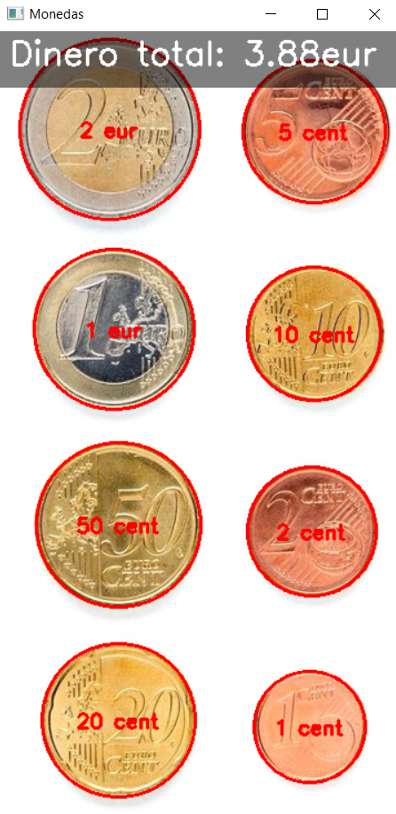
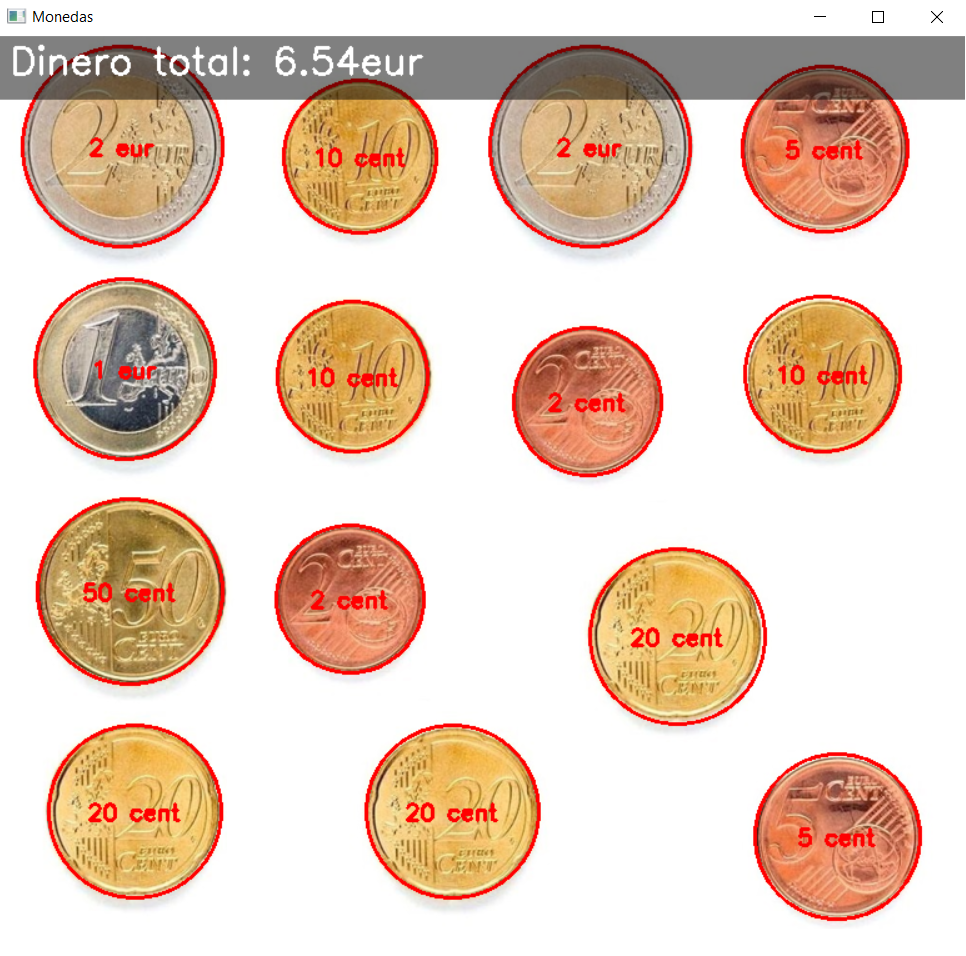

# Práctica 3. Detección y reconocimiento de formas

Este repositorio contiene la **Práctica 3** donde se utilizan técnicas de procesamiento de imágenes con **OpenCV** para la detección y caracterización geométrica de objetos. 

# Índice

- [Práctica 3. Detección y reconocimiento de formas](#práctica-3-detección-y-reconocimiento-de-formas)
- [Índice](#índice)
  - [Librerías utilizadas](#librerías-utilizadas)
  - [Autores](#autores)
  - [Tareas](#tareas)
    - [Tarea 1](#tarea-1)
    - [Tarea 2](#tarea-2)
  - [Referencias y bibliografía](#referencias-y-bibliografía)

## Librerías utilizadas

[](https://numpy.org/)
[](https://opencv.org/)
[](https://matplotlib.org/)
[](https://scikit-learn.org/)
[](https://seaborn.pydata.org/)


## Autores

Este proyecto fue desarrollado por:

- [](https://github.com/gitfrandu4)
- [](https://github.com/DerKom)

## Tareas

### Tarea 1
La tarea consiste en localizar las monedas dentro de una imagen y realizar la suma de sus valores. Para ello, seleccionamos la moneda de 1eur como referencia y el programa logra la funcionalidad deseada de la siguiente manera:

### Definición de Diámetros de Monedas
```python
diametros_monedas = {
    '1 cent': 16.25,
    '2 cent': 18.75,
    '5 cent': 21.25,
    '10 cent': 19.75,
    '20 cent': 22.25,
    '50 cent': 24.25,
    '1 eur': 23.25,
    '2 eur': 25.75
}
```
Comenzamos con la definición de un diccionario que almacena los diámetros reales de diferentes monedas en milímetros.

#### Redimensionar la Imagen
```python
scale_width = screen_width / width
scale_height = screen_height / height
scale = min(scale_width, scale_height)
imagen_redimensionada = cv2.resize(imagen, (new_width, new_height), interpolation=cv2.INTER_AREA)
```
El tamaño de la imagen se ajusta para que quepa en una ventana con dimensiones predeterminadas (1280x720), manteniendo la relación de aspecto.

#### Conversión a Escala de Grises y Suavizado
```python
imgGris = cv2.cvtColor(imagen_redimensionada, cv2.COLOR_BGR2GRAY)
imgGris_suavizada = cv2.GaussianBlur(imgGris, (11, 11), 2)
```
Se convierte la imagen a escala de grises para simplificar la detección de bordes. Luego, se aplica un suavizado Gaussian Blur para reducir el ruido en la imagen.

#### Detección de Círculos
```python
monedasDetectadas = cv2.HoughCircles(
    imgGris_suavizada,
    cv2.HOUGH_GRADIENT,
    dp=1,
    minDist=100,
    param1=100,
    param2=60,
    minRadius=40,
    maxRadius=150
)
```
Se utiliza el método `HoughCircles` para detectar los círculos (monedas) en la imagen. Esta función busca patrones circulares y detecta sus posiciones y radios.

#### Almacenar Monedas Detectadas
```python
coins = []
for i in monedasDetectadas[0, :]:
    coin = {
        'center': (i[0], i[1]),
        'radius': i[2],
        'value': None,
        'diameter_px': i[2] * 2
    }
    coins.append(coin)
```
Los datos de las monedas detectadas se almacenan en una lista de diccionarios, donde se registra el centro, radio y diámetro en píxeles de cada moneda.

#### Selección de Moneda de Referencia con Click
```python
def onclick(event, x, y, flags, param):
    if event == cv2.EVENT_LBUTTONDOWN:
        for coin in coins:
            dx = x - coin['center'][0]
            dy = y - coin['center'][1]
            distancia_cuadrada = dx ** 2 + dy ** 2
            if distancia_cuadrada <= coin['radius'] ** 2:
                print("Moneda seleccionada como referencia (1 EUR)")
                pixel_mm_ratio = coin['diameter_px'] / diametros_monedas['1 eur']
                identificar_monedas()
                break
```
Se define una función que detecta clics del usuario en la imagen. Cuando el usuario hace clic sobre una moneda, esta se toma como referencia (moneda de 1 EUR) y se calcula la relación píxeles/mm.

#### Identificación de Monedas Restantes
```python
def identificar_monedas():
    for coin in coins:
        if coin['value'] is None:
            diametro_mm = coin['diameter_px'] / pixel_mm_ratio
            idx = (np.abs(diametros_reales - diametro_mm)).argmin()
            coin['value'] = valores_monedas[idx]
            print(f"Moneda identificada: {coin['value']}")
```
Una vez que se ha seleccionado una moneda de referencia, el programa calcula el tamaño de las otras monedas y las compara con los diámetros conocidos para identificar su valor.

#### Mostrar Resultado y Calcular Suma Total
```python
total_sum = 0
for coin in coins:
    if coin['value'] is not None:
        value_str = coin['value']
        if 'cent' in value_str:
            value = int(value_str.split(' ')[0]) / 100
        elif 'eur' in value_str:
            value = float(value_str.split(' ')[0])
        total_sum += value
```
Se calcula y muestra la suma total del valor de todas las monedas detectadas.

#### Resultados
<table>
  <tr>
    <td style="text-align: center; padding-right: 20px;">
      
    </td>
    <td style="text-align: center;">
      
    </td>
  </tr>
</table>

### Tarea 2

## Referencias y bibliografía

- OpenCV Documentation: https://docs.opencv.org/
- NumPy Documentation: https://numpy.org/doc/
- Matplotlib Documentation: https://matplotlib.org/stable/contents.html
- OpenCV Documentation: [docs.opencv.org](https://docs.opencv.org/)
- NumPy Documentation: [numpy.org/doc](https://numpy.org/doc/)
- Tutoriales de Python y OpenCV: [pyimagesearch.com](https://www.pyimagesearch.com/)
